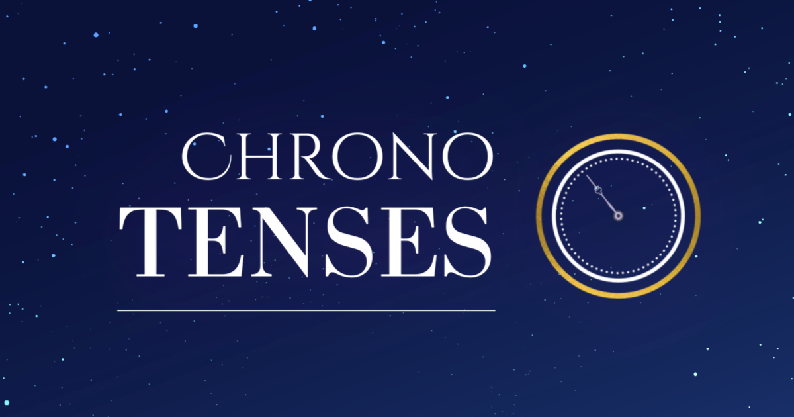
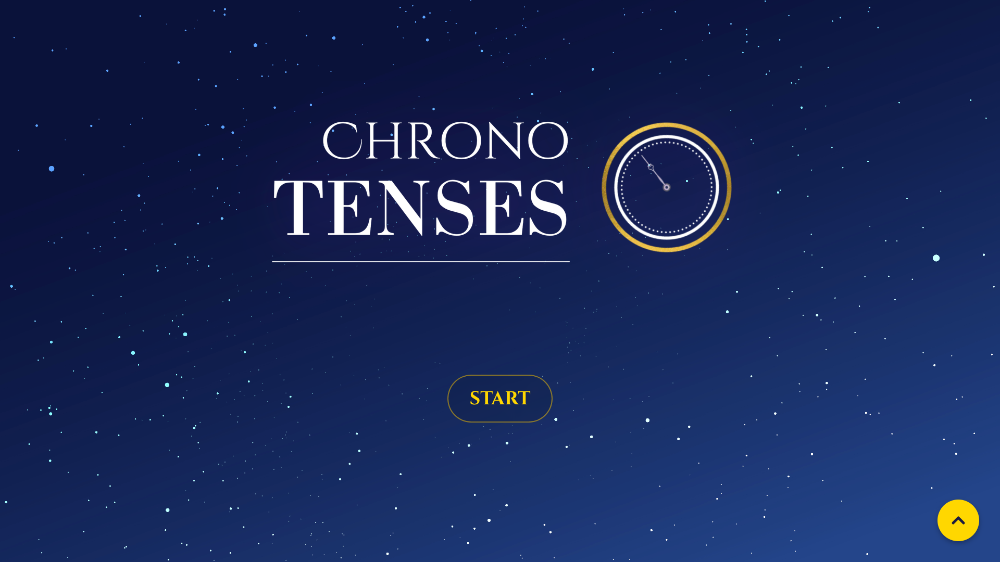
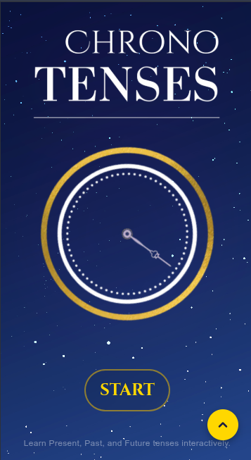
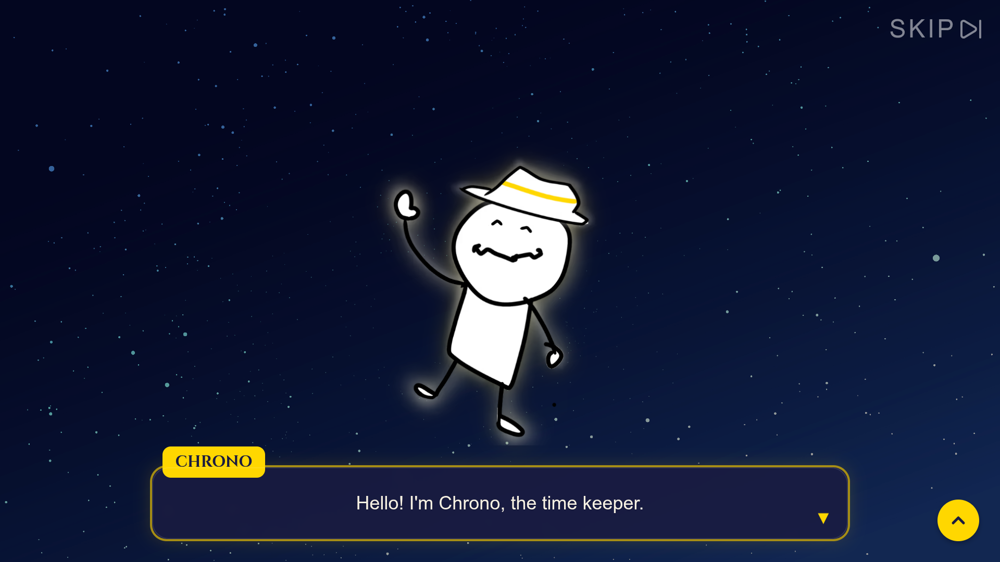
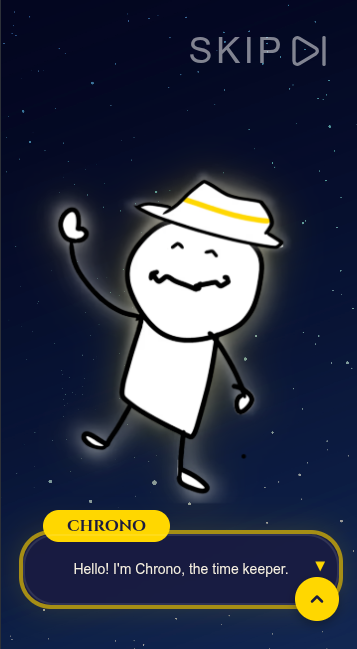
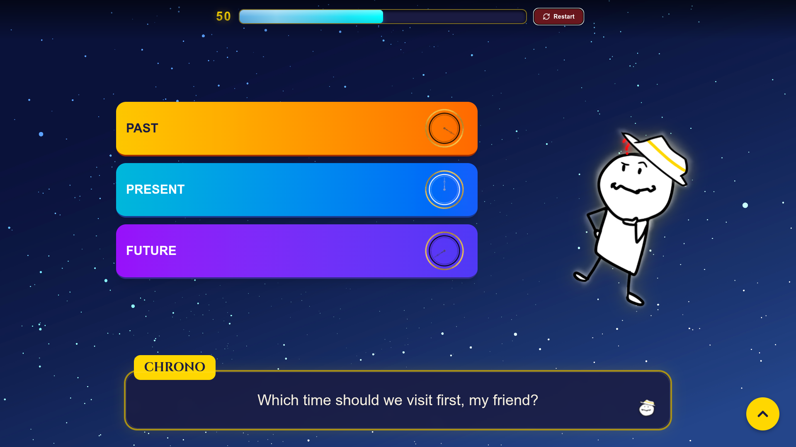
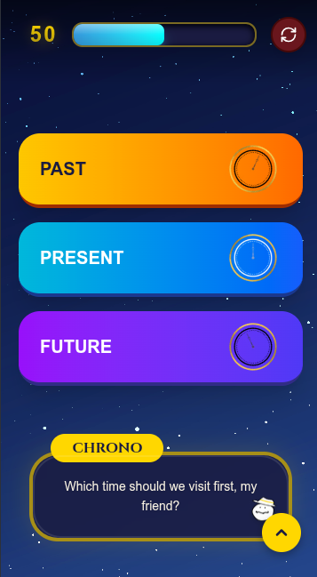

# ⏳ Chrono Tenses

An interactive web game for learning English tenses through a time-travel adventure.



## ✨ About

Chrono Tenses is an educational browser game built with Next.js where players travel across timelines and repair broken history by mastering English grammar tenses.

Instead of traditional multiple-choice exercises, players actively type the correct answers to restore Chrono Energy and stabilize the timeline.

## 🎮 Features

- Interactive English tense gameplay
- Story-driven tutorial experience
- Real-time answer feedback
- Timeline-based learning system
- Responsive UI for desktop & mobile
- Immersive visual novel inspired presentation
- Persistent game progress using localStorage

## 🧠 Learning Focus

Players learn:

- Present Tenses
- Past Tenses
- Future Tenses
- Grammar consistency
- Contextual sentence understanding

## 🛠 Tech Stack


- Framer Motion
- Lucide React

## 🚀 Getting Started

Clone the repository:

```bash
git clone https://github.com/yuzikakal/ChronoTenses.git
```

Install dependencies:

```bash
npm install 
# or 
bun i
```

Run development server:

```bash
npm run dev 
# or 
bun dev
```

Open your browser to see the result:

```txt
http://localhost:3000
```

## 📂 Project Structure

```txt
app/
 ├── game/
 ├── story/
 └── hooks/
components/
 ├── panel/
 ├── providers/
 └── view/
lib/
 └── aiEngine/
public/
 ├── characters/
 ├── icons/
 ├── music/
 ├── sfx/
 └── tutorial/

```

## 🌌 Gameplay Flow

```txt
Landing Page
   ↓
Story & Tutorial
   ↓
Timeline Repair Gameplay
   ↓
Result Screen
```

## 📸 Screenshots

### Landing Page

<div align="center">

<table>
<tr>
<td align="center" width="50%">

Desktop View



</td>

<td align="center" width="50%">

Mobile View



</td>
</tr>
</table>

</div>

### Story Mode

<div align="center">

<table>
<tr>
<td align="center" width="50%">

Desktop View



</td>

<td align="center" width="50%">

Mobile View



</td>
</tr>
</table>

</div>

### Gameplay

<div align="center">

<table>
<tr>
<td align="center" width="50%">

Desktop View



</td>

<td align="center" width="50%">

Mobile View



</td>
</tr>
</table>

</div>

## 🔍 SEO

Chrono Tenses includes:

- Sitemap support
- Robots.txt configuration
- Open Graph metadata
- Twitter Cards
- Structured Data (JSON-LD)

## 👤 Author

Created by Yuzikakal

- GitHub: https://github.com/yuzikakal
- Instagram  : https://instagram.com/yuzika_kalzamzami
- Facebook   : https://facebook.com/yuzikakal2
- Portofolio : https://yuzika5.wordpress.com

## 📜 License

This project is licensed for educational purposes.